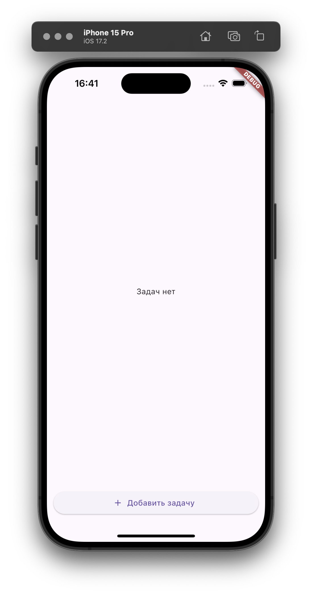
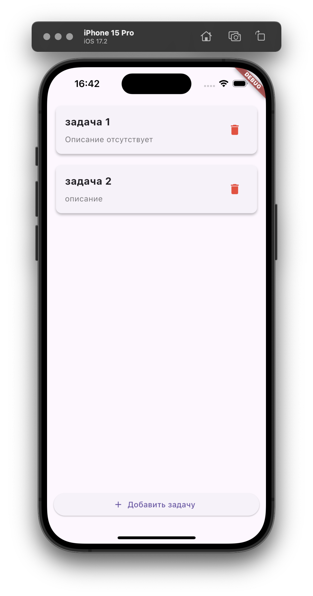
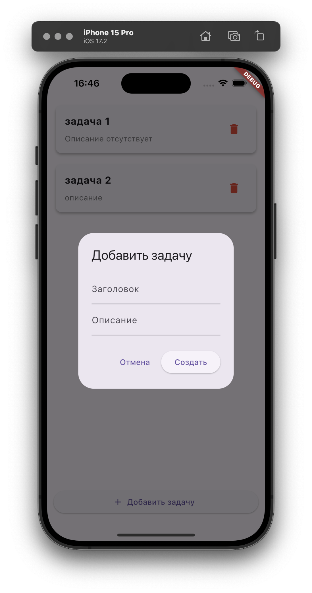
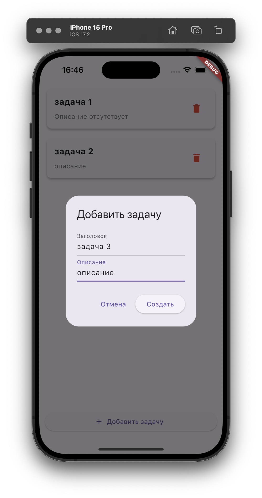
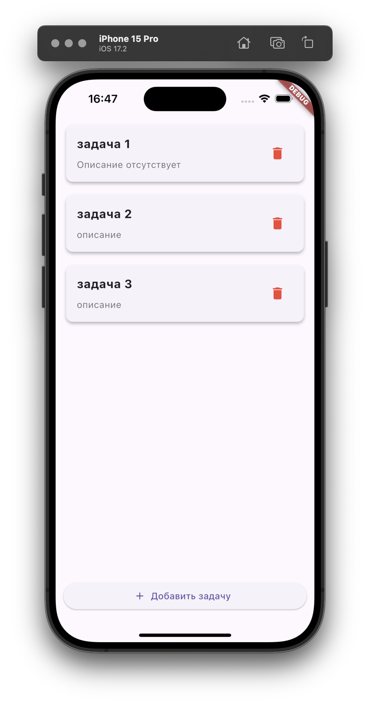
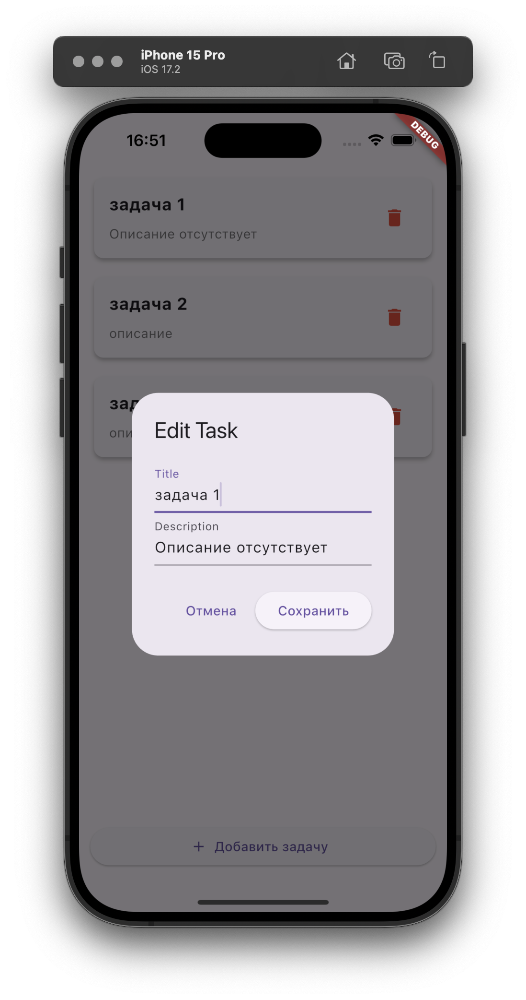
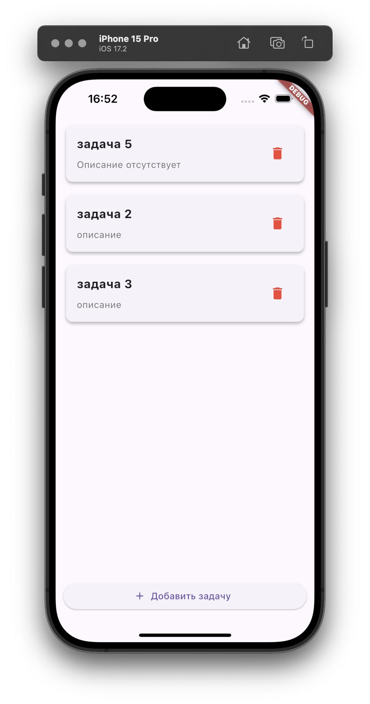
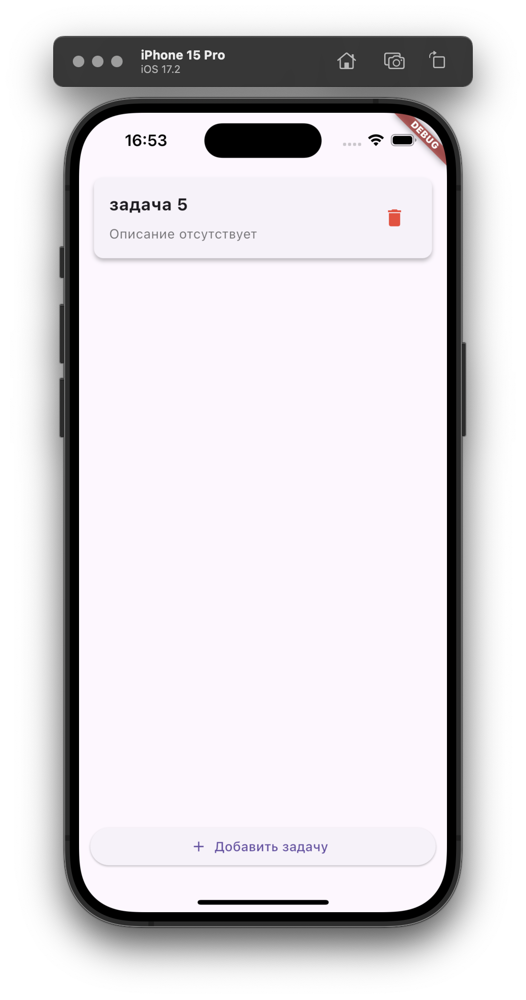

## Содержание

- [Задание](#задание)

- [Как запускать проект](#как-запускать-проект)

- [Запросы в GraphQL](#запросы-в-graphql)

    - [Queries](#queries)

        - [Сортировка](#сортировка)

        - [Фильтрация](#фильтрация)

    - [Mutations](#mutations)

        - [Добавление](#добавление)

        - [Обновление](#обновление)

        - [Удаление](#удаление)

- [Мобильное приложение](#мобильное-приложение)

    - [Главный экран](#главный-экран)

    - [Добавление задачи](#добавление-задачи)

    - [Редактирование задачи](#редактирование-задачи)

    - [Удаление задачи](#удаление-задачи)

## Задание

`graphql` + `flutter` + `bloc`. Мобилка должна быть четко разделена на компоненты.   
С помощью `graphql` будет делать простые запросы на бэк. 

Запросы должны включать:

- получить полный список. 

- добавить элемент. 

- удалить элемент. 

- редактировать элемент. 

## Как запускать проект

Бэкенд запускается в Docker, поднимается база данных и API с помощью docker-compose. Есть сценарии для `Makefile`:

```
make docker
```

```
make docker-rebuild
```

Тестирование проводил в браузере и на iOS-симуляторе, команда для запуска в браузере:

```
flutter run -d chrome --web-hostname=localhost --web-port=5000
```

для симултора на iOS: 

```
open -a Simulator
flutter run
```

## Запросы в GraphQL

### Queries

Запрос на получение коллекции задач: 

```graphql
query {
  tasks {
    id
    title
    description
  }
}
```

Пример ответа: 

```json
{
  "data": {
    "tasks": [
      {
        "id": 8,
        "title": "Задача 1",
        "description": "Описание отсутствует"
      },
      {
        "id": 9,
        "title": "Задача 2",
        "description": "описание"
      },
      {
        "id": 10,
        "title": "Задача 3",
        "description": "Описание отсутствует"
      }
    ]
  }
}
```

Для запроса так же была добавлена фильтрация и сортировка, примеры:

#### Сортировка

```graphql
query {
  tasks(
    order: { id: DESC }
  ) {
    id
    title
    description
  }
}
```

Ответ: 

```json
{
  "data": {
    "tasks": [
      {
        "id": 10,
        "title": "Задача 3",
        "description": "Описание отсутствует"
      },
      {
        "id": 9,
        "title": "Задача 2",
        "description": "описание"
      },
      {
        "id": 8,
        "title": "Задача 1",
        "description": "Описание отсутствует"
      }
    ]
  }
}
```

#### Фильтрация

```graphql
query {
  tasks(where: { id: { eq: 9 } })
  {
    id
    title
    description
  }
}
```

Ответ: 

```json
{
  "data": {
    "tasks": [
      {
        "id": 9,
        "title": "Задача 2",
        "description": "описание"
      }
    ]
  }
}
```

### Mutations

#### Добавление

Для создания задачи необходимо указать название, описание только при необходимости:

```graphql
mutation {
  addTask(title: "Новая задача") {
    id
    title
    description
  }
}
```

Ответ: 

```json
{
  "data": {
    "addTask": {
      "id": 14,
      "title": "Новая задача",
      "description": "Описание отсутствует"
    }
  }
}
```

Добавление задачи с описанием: 

```graphql
mutation {
  addTask(title: "Новая задача с описанием", description: "новое описание") {
    id
    title
    description
  }
}
```

Ответ: 

```json
{
  "data": {
    "addTask": {
      "id": 13,
      "title": "Новая задача с описанием",
      "description": "новое описание"
    }
  }
}
```

#### Обновление

Обновлние заголовка и описания задачи:

```graphql
mutation {
  updateTask(
    id: 14
    title: "Обновленная задача"
    description: "Обновленное описание"
  ) {
    id
    title
    description
  }
}
```

Ответ: 

```json
{
  "data": {
    "updateTask": {
      "id": 14,
      "title": "Обновленная задача",
      "description": "Обновленное описание"
    }
  }
}
```

Обновление только описания задачи: 

```graphql
mutation {
  updateTask(
    id: 14
    description: "описание"
  ) {
    id
    title
    description
  }
}
```

Ответ: 

```json
{
  "data": {
    "updateTask": {
      "id": 14,
      "title": "Обновленная задача",
      "description": "описание"
    }
  }
}
```

Обновление только заголовка задачи

```graphql
mutation {
  updateTask(
    id: 14
    title: "задача"
  ) {
    id
    title
    description
  }
}
```

Ответ: 

```json
{
  "data": {
    "updateTask": {
      "id": 14,
      "title": "задача",
      "description": "описание"
    }
  }
}
```

#### Удаление

```graphql
mutation {
  deleteTask(id: 14)
}
```

Ответ: 

```json
{
  "data": {
    "deleteTask": true
  }
}
```

## Мобильное приложение

### Главный экран

На главном экране отображается список созданных задач, при отсутствии таких будет выведено соответствующее сообщение:

<div class="images">
    
    
</div>

### Добавление задачи

Для добавления задачи необходимо нажать кнопку **"Добавить задачу"** в нижней части экрана, в открывшемся модальном окне указать название и описание(необязательно), затем нажать кнопку **"Создать"**:

<div class="images">
    
    
    
</div>

### Редактирование задачи

Для редактирования задачи необходимо нажать на карточку задачи, в открывшемся модальном окне изменить необходимые параметры, затем нажать кнопку **"Сохранить"**:

<div class="images">
    
    
</div>

### Удаление задачи

Для удаления задачи необходимо нажать на соответствующуюю кнопку у карточки задачи:

<div class="images">
    
    
</div>

> При запуске в браузере все будет выглядеть примерно так же, как и на мобильном устройстве.